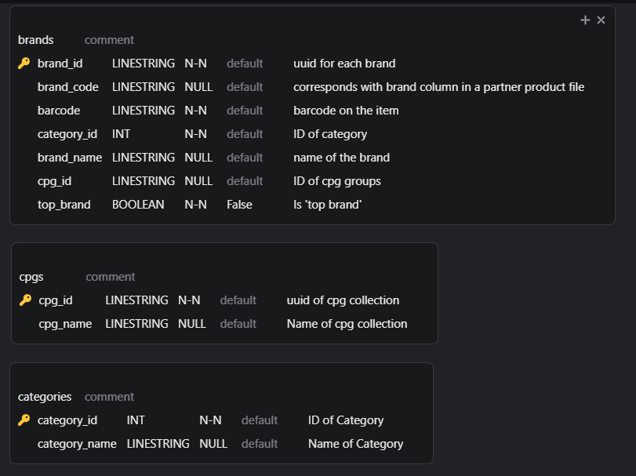
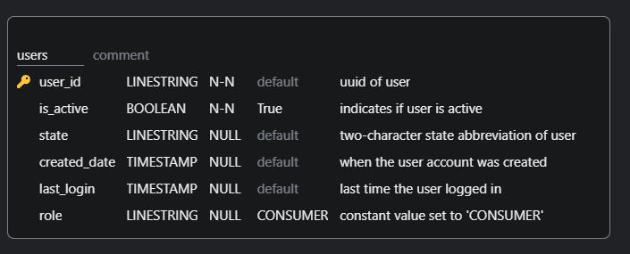
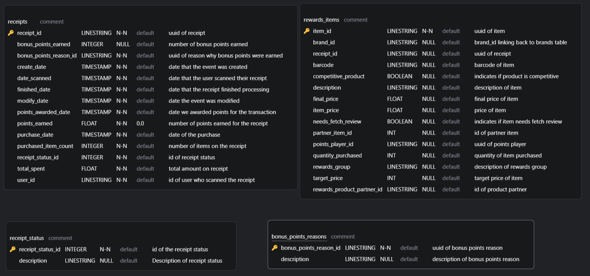

# fetch-analytics-eng-application

1. Structured Relational Data Model

The three data models that would be present in the data warehouse are as follows:

`brands`

`users`

`receipts`

2. Queries for Business Stakeholders
        
        
- The file `queries\average_receipt_spend_by_status.sql` contains a query that will display information about the average amount spent by users for `Accepted` and `Rejected` receipt statuses.

- The file `queries\number_items_purchased_by_receipt_status.sql` contains a query that will display information about the total number of items users purchased for `Accepted` and `Rejected` receipt statuses.

- The file `queries\top_5_brands_by_receipts.sql` contains a query that will display the top 5 brands, according to amount spent by consumers, within the month of April. The dates within the query may be changed to inspect different time periods as well.

3. Data Quality Issues

- `brands.jsonl`
- Analysis shows that of all brands in the file, 76% are unique, and 30% are invalid "Test" brands. Additionally, very few of the records (fewer than 3%) are marked as top brands, and nearly 97% of entries are missing the topBrand field. Additionally, 23% of the records are missing a brand code.
    - Percentage of unique brands in file: 76.8 %
    - Percentage of invalid brands in file: 30.8 %
    - Percentage of top brands in file: 2.7 %
    - Percentage of entries missing brand codes: 23.1 %
    - Percentage of entries missing top brand flag: 97.3 %
- `receipts.jsonl`
- Analysis shows that a majority of receipts are in the `Submitted` or `Finished` status, with minorities in `Flagged`, `Rejected`, and `Pending`. There were no receipts in the data with a status of `Accepted`. Based on the provided data, consumers purchased an average of 6 items with each receipt. Additionally, over 30% of receipts had just one item. Almost 40% of the receipts had zero items, bringing into question the overall quality of the dataset.
    - Counts of receipt statuses: {'FLAGGED': 46, 'SUBMITTED': 434, 'REJECTED': 71, 'PENDING': 50, 'FINISHED': 518}
    - Average number of items purchased by consumers: 6.2
    - Percentage of receipts with just one item: 33.7 %
    - Percentage of receipts with zero items: 39.3 %

- `users.jsonl`

4. Clairfying Questions